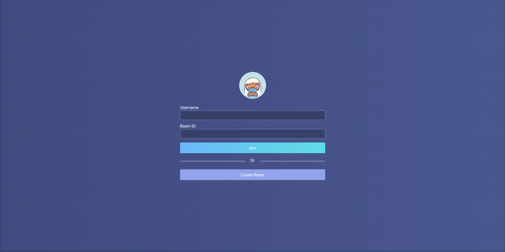
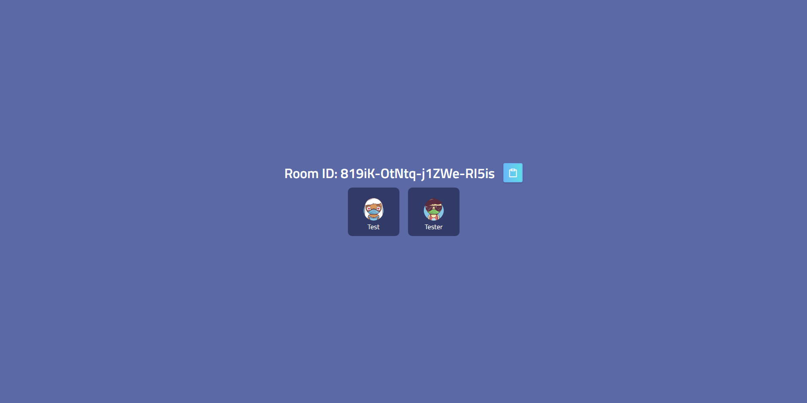
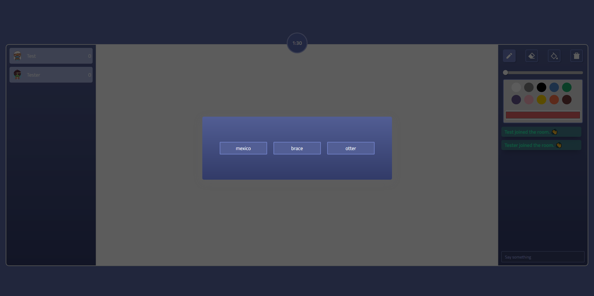
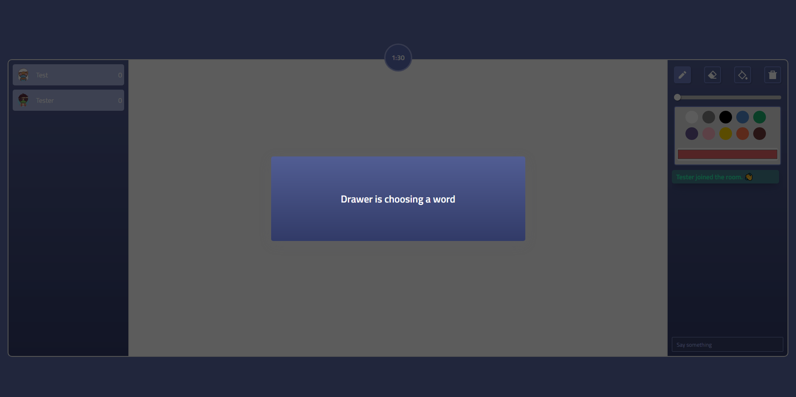

# Joonistame

A multiplayer drawing and guessing game. There is one drawer and the other user(s) are the guessers.

Live site hosted at: [https://joonistame.vercel.app](https://joonistame.vercel.app)

## Scripts for Local Development

- `yarn install`: To install the dependencies
- `yarn dev`: Runs the React app and starts up the server
- `yarn start`: Starts the development app
- `yarn build`: Builds the production app

Open [http://localhost:3000](http://localhost:3000) to view it in the browser.

## Tech Stack
- React
- SCSS
- Node.js
- Express
- Socket.io
- Dgraph
- Vercel

## Screenshots

### Join Page

### Lobby Page

### Game Room Page (Drawer View)

### Game Room Page (Guesser View)

## Todo List
* [ ]  Fix input pencilWidth
* [ ]  Disable canvas for all users, but the current drawer
* [ ]  Make the color picker update correctly
* [ ]  Fix current server and finish implementing Dgraph